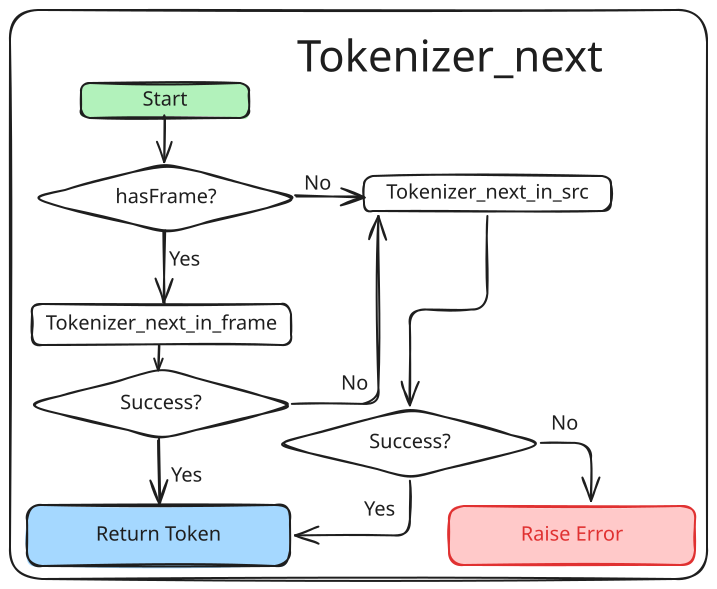
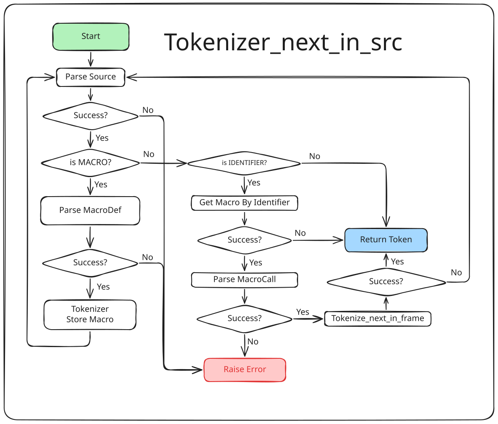
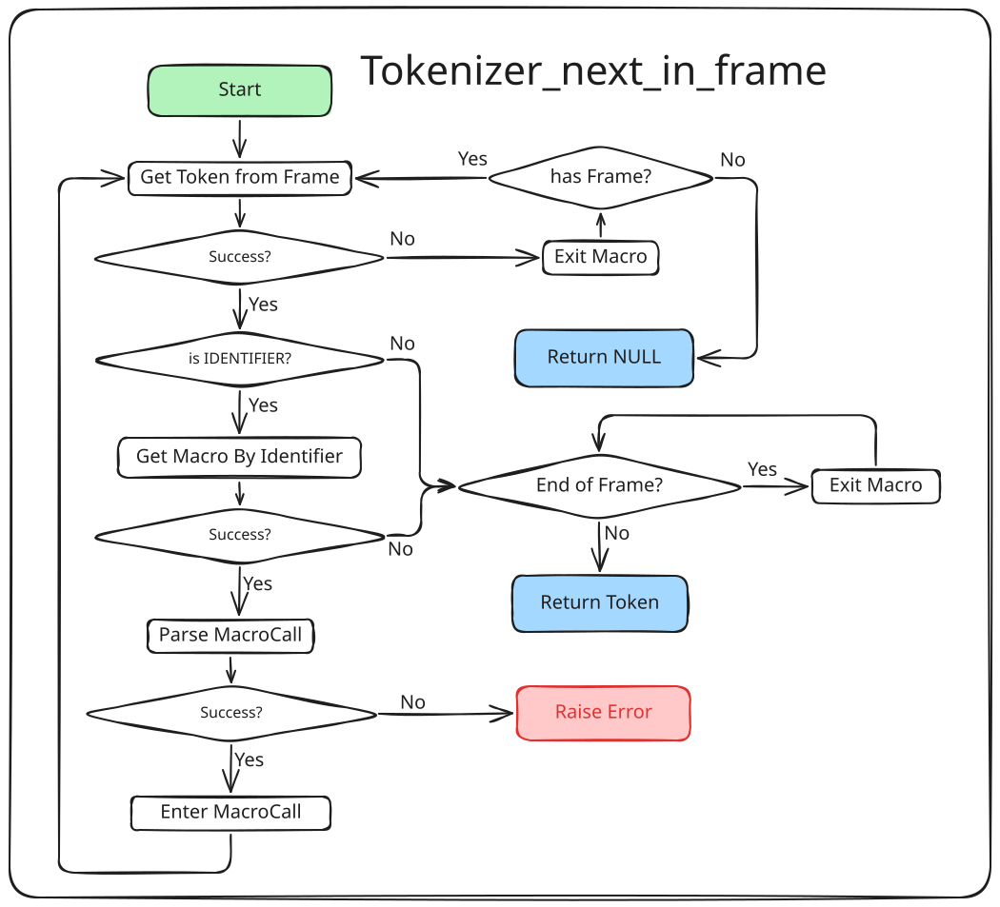

# xMachine - An Assembler Generator

This project provides a method to generate an assembler in C or binary executable file.

## Functions

Users can write a script of target instruction set architecture,
and use this project to generate a C library.

The C library generated contains these functions:

1.  `uint32_t ${instr}(Array<uint8_t> *, ...)` to encode an instruction and write into an array;
2.  `void* getCurrentMachine(void)` to get the address of the current context machine;
3.  `void setCurrentMachine(void*)` to set the current context machine;

## Build and dependence

This project using a python script to generate some source files.
And it is written in C and request standard of C23, built with cmake.

So please make sure the python and cmake in the PATH environment,
and your C compiler supports cstd-23.

Then run command:
```shell
cmake -B <cmake-output-dir> -S <this-project-root-dir> -DCMAKE_C_COMPILER=<your-compiler>
cmake build <cmake-output-dir> --target machine --parallel <your-cpu-core-count>
```

Without any error, there is a directory named `output` in the `<this-project-root-dir>`
and an executable file named `machine` in it.

Then write some script to experience it!

## Presets

[x86_64](preset/x64): prefabricated machine script for x86_64 architecture.

## Grammar of machine script

The assembler is supposed to be defined with a special text grammar.

The generator read text inputs and analysis by the grammar and then generate a C header file and,
a source file or a library archive file if no error.

In the script, an assembler is called machine, cause every assembler is specified with a certain instruction set architecture,
i.e. a certain machine architecture.

If there's a machine are going defined, it is supposed to specify three kinds of things: **register groups**, **memories** and **instructions**.
To define the machine, there's a keyword should be presented: `machine`.
Then an identifier should be provided the machine's name.
The definitions of these three properties should be placed in a `{` and `}` pair follow the machine's name.
Every kind of properties should contain one or more definition items.
Those properties definition items should also be led by keywords: `register`, `memory` or `instruction`.
Every definition item's contents should be bracketed with `{` and `}` and ended with `;`.

For example, a definition of machine "abc" should be like:
```
machine abc {
    macro ... { ... };
    register ... { ... };
    memory ... { ... };
    memory ... {
        ...
    };
    instruction ... { ... };
    register ... { ... };
    instruction ... {
        ...
    };
    ...
};
```
(Here `...` means some texts.)

For every kind of properties, the grammar and contents are different.

#### Register Group

A RegisterGroup gives a description for registers of machine which share a same real location.

Every RegisterGroup should be led by a keyword `register`.
A RegisterGroup should be assigned an identifier as its name, and also should provide a [width](#width-bit-field-and-time-tick).
A RegisterGroup should have one or more register. Every register is a unique item.
A register definition item is composed by an identifier as register's name, a [bit field](#width-bit-field-and-time-tick) and a code.
The bit field presents which bits would be modified if the register be involved a computation.
The code is the encoding form of register in instructions. It will be used in machine code generation.
Write it in a more formal grammar:
```
<identifier> : <bit field> = <code> ;
```

An example of a RegisterGroup would be like:
```
register ax [64-bit] {
    rax: [63-0] = 0x00;
    eax: [31-0] = 0x00;
    ax : [15-0] = 0x00;
    ah : [15-8] = 0x04;
    al : [7-0]  = 0x00;
};
```

The text above defines a RegisterGroup named `ax` and full width is 64 bits.
In this RegisterGroup, there are 5 registers, named `rax`, `eax`, `ax`, `ah` and `al`.
For `rax`, it occupies all 0 to 63rd bit (total 64 bits) and will be encoded as `0x00` in instructions.
But for `ah`, it only takes 8 to 15th bit (total 8 bits) and will be encoded as `0x04` in instructions.
The others could be read in same way.

Therefore, it is easy to know that **registers in the same group will exclude each other**.

#### Memory

A Memory definition item gives actually the Memory addressing mode of a machine. It's led by the keyword `memory`.

A Memory definition item have some fields.

These fields can be register set or immediate.

If a field is a register set, the assembler will check its type.

A [width](#width-bit-field-and-time-tick) follows the name of memory is required.

For example:
```
memory local [12-bit] {
    reg: [0-5] = Gv;
    off: [6-12];
};
```
The text above defines a Memory addressing mode named `local`, which has total 12 bits.
Its first 6 bits is a code of registers those in `Gv` which is a register group or register set.
The last 6 bits is an unsigned immediate number by default.

#### Instruction

An Instruction definition item provides the byte code layouts of an Instruction's machine code.

An Instruction definition item led by a keyword `instruction` and an identifier as its name.
Like other machine properties, contents of Instruction definition items should be bracketed with `{` and `}`.

A statement in an instruction definition item are called a **form** of the instruction.
A form consists with a [pattern](#pattern-of-instruction-form) and a description.
The pattern given arguments the form used and the description provides the width, the time cost and the main body of the form.

contents of a form body will be bracketed with `{` and `}`.
In the form body, every part has a name and a value.

A `:` should follow part's leader and a [width](#width-bit-field-and-time-tick) should be provided.
Each part of the form body should provide a [bit field](#width-bit-field-and-time-tick) preceded by `=`, means the part's layout. 
In formal grammar, it would be
```
<part> : <width> = <layout> ;
```
The actual layout of these three parts can be numbers, variables, attributes, or bit field mappings.
For example, the
```
instruction foo {
    [local aaa, rax bbb] = [10-byte] (4-tick) {
        prefix: [8] = 0x12;
        arguments: [32] = {
            [0-5] = 0x34,
            [31-24] = bbb[13-20],
            [22-11] = aaa.yyy,
            [...] = 0
        }
        opcode: [8] = aaa.xxx;
    };
};
```
defines an Instruction `foo` with only one form. The form in binary will be like
```
─────┬────────┬──────┬─────┬────────────┬─┬────────┬────────┬─────
 ... │00010010│110100│00000│yyyyyyyyyyyy│0│bbbbbbbb│xxxxxxxx│ ...
─────┼────────┼──────┼─────┼────────────┼─┼────────┼────────┼─────
 ... │  0x12  │ 0x34 │     │  aaa.yyy   │ │  bbb   │ aaa.xxx│ ...
─────┼────────┼──────┴─────┴────────────┴─┴────────┼────────┼─────
 ... │ prefix │              arguments             │ opcode │ ...
─────┴────────┴────────────────────────────────────┴────────┴─────

```
and it will cost 4 cpu [time tick](#width-bit-field-and-time-tick) to execute.


#### Immediate

An Immediate provides a type data with fixed width.

Every Immediate should start with a keyword `immediate`.
And an identifier follows as its name.
A [width](#width-bit-field-and-time-tick) must be provided for an immediate. 
Then an optional field can be set as its type.
The type can be one of the following table:

|   type   |      means       |
|:--------:|:----------------:|
| unsigned | unsigned integer |


Example:
```
immediate refer [23-bit] unsigned;
```

Immediate only used in Sets or Instructions.

#### Set

A Set is a special collection of registers, memories or Immediate.

Every Set definition item starts with a keyword `set` and an identifier as its name.
Its contents are bracketed with `{` and `}`, and seperated with commas.
Every element of a Set is a Register, Memories or Immediate.
And all elements of a Set should be items of same type. 

For example
```
set reg { rax, rbx, rcx };
set mem { local, short, long };
set imm { offset, index, bimp };
```

Sets only used in Instructions.

#### Pattern of Instruction Form

A pattern of an instruction form is consist of identifiers seperated with comma and bracketed with `[` and `]`.
Items of a pattern are called parameters. Every parameter has two part: type and name.

Type of parameter can be a register, a register group, a set, an immediate or a memory.

Name of parameter commonly is an identifier, but it should not be any other record's name,
also not be other same pattern parameter's name.

Example
```
[ax a, local b, bx c]
```
the order of the parameters does matter.

### Appendix 1 - Terminal Token

#### width, bit field and time tick

A width is a number with data units and bracketed with `[` and `]`. 
The data units can be `bit` or `byte`.
The data units can be omitted. When data unit omitted, the default data unit is `bit`.
If the data unit not omitted, the data unit should be contacted with `-`.
For examples

```
[16-bit], [7-byte], [32]
```
Specially, a variable width can be set as `[?]` means the width is determined by the value,
but it can only be used in definition of instruction forms.

A bit field are two number contacted with `-`.
These two number are called left(highest) bound and right(lowest) bound of the bit field.
The range of bit field contains its bounds.
For example
```
[1-2], [23-55], [9-9]
```

A time tick is a number with time units and bracketed with `(` and `)`.
The time units can only be `tick` means one CPU's clock cycle.
Examples:
```
(1-tick), (3-tick)
```

#### identifier

An identifier is a text string consists with letters, digits or `_`, but starts with `_` is not allowed.

### Appendix 2 - Total Grammar

The machine entries grammar is:
```
Machine = MACHINE IDENTIFIER LEFT_BRACKET Entries RIGHT_BRACKET SEMICOLON;
Entries = Entries Entry | Entry;
Entry = RegisterGroup | Instruction | Memory | Immediate | EntrySet;

RegisterGroup = REGISTER IDENTIFIER WIDTH LEFT_BRACKET Registers RIGHT_BRACKET SEMICOLON;
Memory = MEMORY IDENTIFIER WIDTH LEFT_BRACKET MemItems RIGHT_BRACKET SEMICOLON;
Instruction = INSTRUCTION IDENTIFIER LEFT_BRACKET InstrForms RIGHT_BRACKET SEMICOLON;
Immediate = IMMEDIATE IDENTIFIER WIDTH TYPE SEMICOLON;
EntrySet = SET IDENTIFIER SetExpr SEMICOLON;

SetExpr = LEFT_PAREN SetExpr RIGHT_PAREN
        | SetExpr ARITH_2_BIN_OP IDENTIFIER
        | SetExpr ARITH_2_BIN_OP LEFT_BRACKET SetItems RIGHT_BRACKET
        | LEFT_BRACKET SetItems RIGHT_BRACKET
        | IDENTIFIER;

Registers = Registers Register | Register;
InstrForms = InstrForms InstrForm | InstrForm;
SetItems = SetItems COMMA IDENTIFIER | IDENTIFIER;
MemItems = MemItems MemItem | MemItem;

MemItem = IDENTIFIER COLON WIDTH SEMICOLON
        | IDENTIFIER COLON WIDTH ASSIGN IDENTIFIER SEMICOLON;

Register = IDENTIFIER COLON BIT_FIELD ASSIGN NUMBER SEMICOLON;

InstrForm = Pattern ASSIGN           LEFT_BRACKET FormCheck InstrParts RIGHT_BRACKET SEMICOLON
          | Pattern ASSIGN TIME_TICK LEFT_BRACKET FormCheck InstrParts RIGHT_BRACKET SEMICOLON;

Pattern = LEFT_SQUARE_BRACKET PatternArgs RIGHT_SQUARE_BRACKET
        | LEFT_SQUARE_BRACKET RIGHT_SQUARE_BRACKET;
FormCheck = Condition SEMICOLON | ;
InstrParts = InstrParts InstrPart | InstrPart;
InstrPart = IDENTIFIER COLON WIDTH ASSIGN Layout SEMICOLON
          | IDENTIFIER COLON WIDTH ASSIGN Layout Condition SEMICOLON;
Layout = Arith_0_Expr | Switchable | LEFT_BRACKET MappingItems RIGHT_BRACKET;
MappingItems = MappingItems COMMA MappingItem | MappingItem;
MappingItem = BIT_FIELD ASSIGN Arith_0_Expr
            | BIT_FIELD ASSIGN Switchable;

Switchable = LEFT_PAREN CondExpr RIGHT_PAREN QUESTION_MARK Options;
PatternArgs = PatternArgs COMMA Parameter
            | Parameter;
Condition = AT LEFT_PAREN CondExpr RIGHT_PAREN;

Options = Options COLON Arith_0_Expr | Arith_0_Expr;
Parameter = IDENTIFIER IDENTIFIER;

```

and the arithemetic expression grammar is:
```
CondExpr = CondExpr BOOL_OR AndCondExpr
         | AndCondExpr;

AndCondExpr = AndCondExpr BOOL_AND SingleCondExpr
            | SingleCondExpr;

SingleCondExpr = LEFT_PAREN CondExpr RIGHT_PAREN
               | BOOL_NOT SingleCondExpr
               | SingleCondExpr COND_BIN_OP SingleCondExpr
               | Variable IN IDENTIFIER
               | COND_SIN_OP Arith_0_Expr
               | Arith_0_Expr;

Arith_0_Expr = Arith_0_Expr ARITH_0_BIN_OP Arith_1_Expr
             | ARITH_0_SIN_OP Arith_0_Expr
             | Arith_1_Expr;
Arith_1_Expr = Arith_1_Expr ARITH_1_BIN_OP Arith_2_Expr
             | ARITH_1_SIN_OP Arith_1_Expr
             | Arith_2_Expr;
Arith_2_Expr = Arith_2_Expr ARITH_2_BIN_OP Arith_3_Expr
             | ARITH_2_SIN_OP Arith_2_Expr
             | Arith_3_Expr;
Arith_3_Expr = LEFT_PAREN Arith_0_Expr RIGHT_PAREN
             | ARITH_3_SIN_OP Arith_3_Expr
             | Evaluable;

Evaluable = Variable BIT_FIELD | OP_WIDTH Variable | Variable | NUMBER;

Variable = IDENTIFIER DOT IDENTIFIER | IDENTIFIER;
```

All the two are defined in [machine.xnf](https://github.com/yaokai-liu/Xnf/blob/liu-machine/machine.xnf).

The macro grammar is:
```
MacroEntry = Macro | MacroCall;

Macro = MACRO IDENTIFIER LEFT_PAREN MacroParams RIGHT_PAREN LEFT_BRACKET Tokens RIGHT_BRACKET;
MacroCall = IDENTIFIER LEFT_PAREN MacroArgs RIGHT_PAREN;

MacroParams = MacroParams COMMA IDENTIFIER | IDENTIFIER | ;
MacroArgs = MacroArgs COMMA MacroArg | MacroArg | ;

MacroArg = LEFT_BRACKET Tokens RIGHT_BRACKET | IDENTIFIER | NUMBER;

Tokens = Tokens TOKEN | Tokens Concat | TOKEN | Concat;

Concat = TOKEN CONCAT TOKEN
       | Concat CONCAT TOKEN;

```

It is defined in [macro.xnf](https://github.com/yaokai-liu/Xnf/blob/liu-machine/macro.xnf).


## Architecture

### Tokenizer

Tokenizer always be called when a next token is requested.








## TODO:

### Codegen/C:

1. machine model;
2. query functions;
3. test work.

### Codegen/elf
